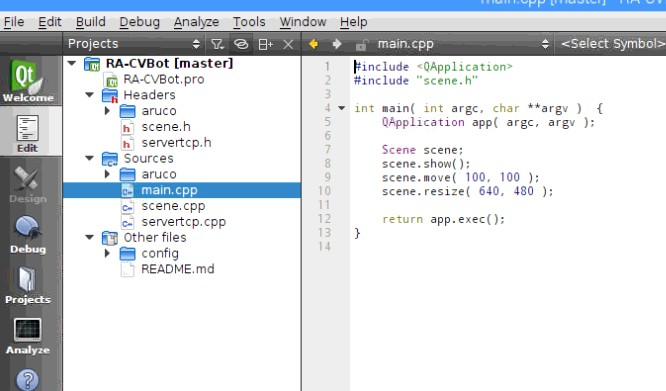

Tutorial SASE 2018
==================

**Visión artificial y reconocimiento de patrones para la movilidad de un robot**

:Docentes: Ing. César Osimani  - Ing. Martín Salamero
:Contacto: cosimani@ubp.edu.ar - martin.salamero@gmail.com
:Código fuente: https://github.com/cosimani/RA-CVBot

Acondicionar la Raspberry Pi 
----------------------------

- Descargar imagen de `Raspbian Stretch with desktop <https://downloads.raspberrypi.org/raspbian_latest>`_

- Es una imagen que deberá ser copiada en la memoria SD ( se pueden usar los aplicativos Win32 Disk Imager (Windows) o Disk Image Writer (Ubuntu) )

- Utilizar la consola para realizar las siguientes instalaciones y configuraciones:

.. code-block::

	cd /home/pi

	sudo apt-get update

	sudo apt-get upgrade

	sudo apt-get install build-essential cmake pkg-config

	sudo apt-get install qt4-dev-tools libqt4-dev libqt4-core libqt4-gui

	sudo apt-get install v4l-utils

	sudo apt-get install qtcreator

	mkdir opencv

	cd opencv

	sudo wget http://liquidtelecom.dl.sourceforge.net/project/opencvlibrary/opencv-unix/3.1.0/opencv-3.1.0.zip

	sudo unzip opencv-3.1.0.zip

	cd opencv-3.1.0

	sudo mkdir build

	cd build

	sudo cmake -D CMAKE_BUILD_TYPE=RELEASE -D CMAKE_INSTALL_PREFIX=/usr/local -D WITH_V4L=ON -D WITH_TBB=ON ..

	sudo make

	sudo make install

	sudo nano /etc/ld.so.conf.d/opencv.conf

	               /usr/local/lib  # Esta línea debe ser copiada en el archivo /etc/ld.so.conf.d/opencv.conf

	sudo ldconfig

- Ahora estamos listos para compilar el proyecto con QtCreator. Podemos seguir los siguientes pasos:

.. code-block::

	- Instalar desde consola el aplicativo Git:

	       sudo apt-get install git

	- Clonamos el repositorio:

	       cd /home/pi

	       mkdir CVbot

	       cd CVbot

	       git clone https://github.com/cosimani/RA-CVBot

	- Abrimos el QtCreator desde consola como root       

	       sudo qtcreator

- Abrimos el proyecto con QtCreator seleccionando el archivo RA-CVBot.pro

	